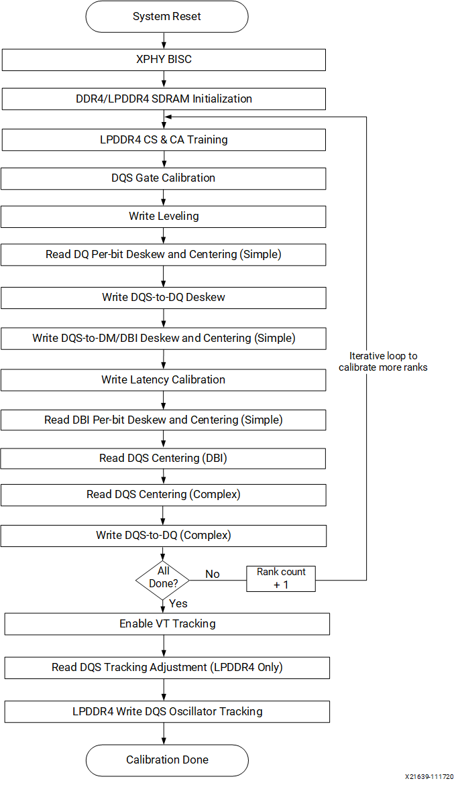

for sync. 
Notes:

AXI to ACP adaptor for A53.
https://github.com/ikwzm/ZynqMP-ACP-Adapter/tree/master/src/main/vhdl

M33 startup,
https://metebalci.com/blog/demystifying-arm-cortex-m33-bare-metal-startup/

Disable MMU and TLB in 32b mode.
https://adaptivesupport.amd.com/s/question/0D52E00007ECNmrSAH/how-do-i-get-rid-of-mmutbl?language=en_US

https://developer.arm.com/documentation/ka001393/latest/

https://developer.arm.com/documentation/ddi0595/2021-06/AArch64-Registers/DAIF--Interrupt-Mask-Bits

MSR DAIF, <Xt>

The PMU can also be used to count errors, for example these events :

0x1A MEMORY_ERROR
0xD0 (L1 Instruction Cache (data or tag) memory error.)
0xD1 (L1 Data Cache (data, tag or dirty) memory error, correctable or non-correctable.)
0xD2 (TLB memory error)

Note that events 0xD0, 0xD1, 0xD2 are supplied to the external PMU event bus, so could be used to generate an interrupt in an external interrupt controller, and are also provided on the internal PMU event bus, so could be used for triggering trace for example in the ETM trace unit.

Exception masking and non-maskable interrupts (NMI)
The previous example represented a very simple case of an interrupt. It is sometimes necessary to be able to disable or mask other interrupts from overriding the currently completing exception. Both physical and virtual asynchronous exceptions can be temporarily masked and left in a pending state until unmasked and the exception is taken. This is done through masking interrupts of the same type until explicitly enabled later.

When the processor takes an exception to an AArch64 execution state, the PSTATE interrupt masks (PSTATE.DAIF) are set automatically. DAIF stands for debug, abort (SError), IRQ, and FIQ. The DAIF field is 4 bits, with each bit corresponding to one of the mentioned exception types. By writing a 1 to a bit in the field, we mask or ignore the exception type. It can go to pending, but not get handled. In other words, the PE does not branch to the exception handler until the bit is unmasked, effectively disabling further exceptions of that type from being taken.

Interrupts are always masked at the Exception level where the interrupt is taken. Synchronous exceptions cannot be masked. This is because synchronous exceptions are caused directly by the execution of an instruction so would block execution if it were then left pending or ignored.

@20240824:
Asynchronous exceptions not taken in EL3 on Cortex A53 r0p2 and above #368
https://github.com/ARM-software/tf-issues/issues/368

Intel Cal algorithm
https://www.intel.com/content/www/us/en/docs/programmable/683216/23-2-2-7-1/ddr4-read-calibration.html

https://docs.amd.com/r/en-US/pg313-network-on-chip/DQS-Gate?tocId=Bzs5pNe25cCF6MjyTRQgEA

DDR Calibrations: 
https://docs.amd.com/r/en-US/pg313-network-on-chip/Calibration-Stages
<picture>
 <source media="(prefers-color-scheme: dark)" srcset="YOUR-DARKMODE-IMAGE">
 <source media="(prefers-color-scheme: light)" srcset="YOUR-LIGHTMODE-IMAGE">
 
</picture>

General concept: 
0) Each master delay line has to be calibrated for the SDRAM clock period. This is done by measuring the number of delay line steps that are required to produce a delay equal to the DDR clock period.
1) Control and data pins on high speed intfc must have accurate alignment with clocks due to skew/PCB trace mismatch. Need to adjust delay at the source (DDR PHY), observe captured control and data signals at the DDR chip and feed back to DDRC/DDRPHY CPU to analyze and program a calculated delay. DDR chips uses the DQ to feedback captured CS/CA to DDRC/DDRPHY
2) Terminations can cause issue with on the mis-alignment too due to reflections. Calibration is done by programming a ODT and calculate BER?
3) VREF causes eye degradation due to saturation. CAL is done by the 2d eye pattern.

AC/ACD - Address/Command
DFU - Device Firmware Update, or short DFU
CA[5:0] - ACT_n, RAS_n, CAS_n, WE_n etc. (Table 84: Command Truth Table)
DBM/I - Data bus mask, inversion
ZQCS (ZQ calibration short)

VT compensation algorithm, maybe multiply by some ratio? 
IPRD	8:0	rw	0x0	Initial Period: Initial period measured by the master delay line calibration
for VT drift compensation. This value is used as the denominator when
calculating the ratios of updates during VT compensation.

Possible issues:
data pin connectivity 
cross talk
dram timing parameters
stability of the VTT/VCCIO power rail

Write Levelling

/**
* Perform DCache all related API test such as Xil_DCacheFlush and
* Xil_DCacheInvalidate. This test function writes a constant value
* to the Data array, flushes the DCache, writes a new value, then invalidates
* the DCache.
* 
* @return	
*     - 0 is returned for a pass
*     - -1 is returned for a failure
*/
int Xil_TestDCacheAll(void)
{
	int Index;
	int Status;
	u32 Value;

